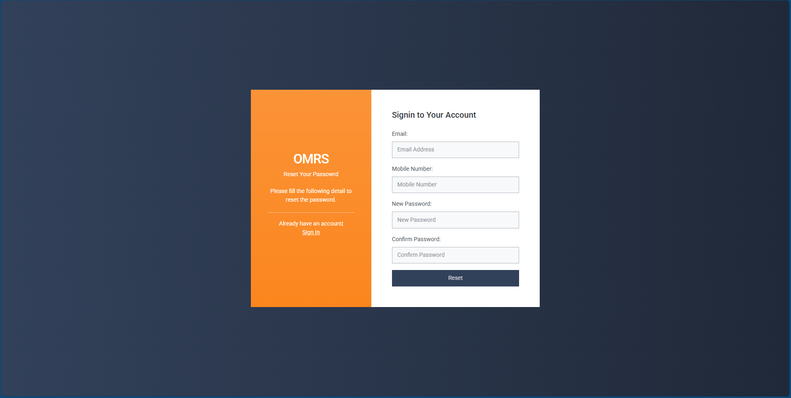
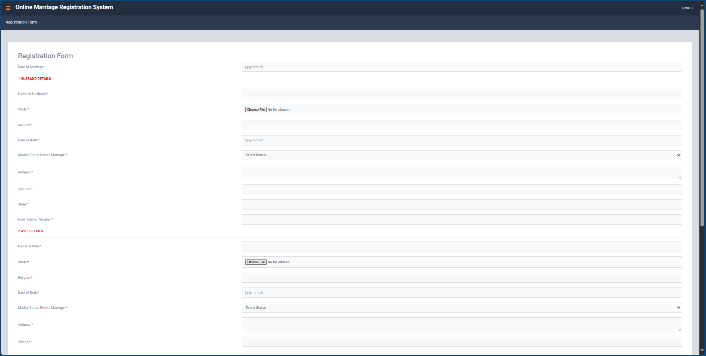

# Online Marriage Registration System

A comprehensive web-based application for managing marriage registrations with separate admin and user interfaces built using PHP and MySQL.

## 🌟 Features

- **User Registration & Login System**
- **Marriage Application Management**
- **Admin Dashboard with Analytics**
- **Document Upload & Verification**
- **Application Status Tracking**
- **Report Generation**
- **Responsive Bootstrap Design**

## 📋 Overview

This system provides a complete digital solution for marriage registration processes. Users can create accounts, submit marriage applications with required documents, and track their application status in real-time. Administrators have access to a comprehensive dashboard for managing applications, verifying documents, generating reports, and maintaining user accounts. The system streamlines the entire marriage registration workflow from application submission to final approval.

## 🖼️ Screenshots

### 🏠 Homepage

*Main landing page with navigation to admin and user portals*

### 👤 User Portal

#### User Login & Registration
<table>
<tr>
<td width="50%">

*User login interface*

</td>
<td width="50%">

*New user registration form*

</td>
</tr>
</table>

#### User Dashboard & Profile
<table>
<tr>
<td width="50%">

*User dashboard with application overview*

</td>
<td width="50%">

*User profile management interface*

</td>
</tr>
</table>

#### Marriage Registration & Status
<table>
<tr>
<td width="50%">

*Comprehensive marriage registration form*

</td>
<td width="50%">

*Application status tracking interface*

</td>
</tr>
</table>

### 👨‍💼 Admin Portal

#### Admin Login & Dashboard
<table>
<tr>
<td width="50%">

*Admin login interface*

</td>
<td width="50%">

*Admin dashboard with system statistics*

</td>
</tr>
</table>

#### Application Management & Reports
<table>
<tr>
<td width="50%">

*All marriage applications management*

</td>
<td width="50%">

*Detailed application view for verification*

</td>
</tr>
</table>

#### Reports & Analytics

*Comprehensive reporting system with date filters*

## 🚀 Quick Start

This system requires a local server environment (XAMPP/WAMP) and MySQL database.

**[📖 View Complete Setup Instructions](SETUP.md)**

## 🛠️ Technologies Used

| Technology | Usage |
|------------|-------|
| **PHP** | Backend Logic |
| **MySQL** | Database Management |
| **Bootstrap** | Responsive UI Framework |
| **JavaScript/jQuery** | Frontend Interactions |
| **CSS3** | Styling |
| **Apache** | Web Server |

